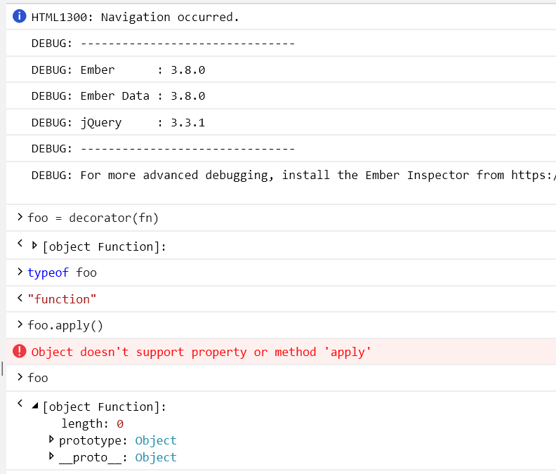

## Steps to reproduce

`yarn start`

Visit the page in MS Edge 18

See in the console `Object doesn't support property or method 'apply'`

### More information

This only appears with the combination of 

- ember-decorators
- ember-cli-typescript@1.5.0

It does not happen with ember-cli-typescript@2.x

The error seems to occur at https://github.com/ember-decorators/ember-decorators/blob/master/packages/utils/addon/decorator.js#L89

It seems that the item returned by `decorate(fn)` is not correctly defined for some reason.

Trying to do `decorator(fn)()` returns 
`unable to get property 'writable' of undefined or null reference`
